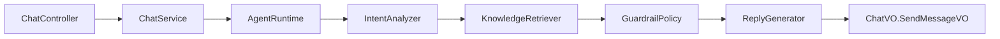
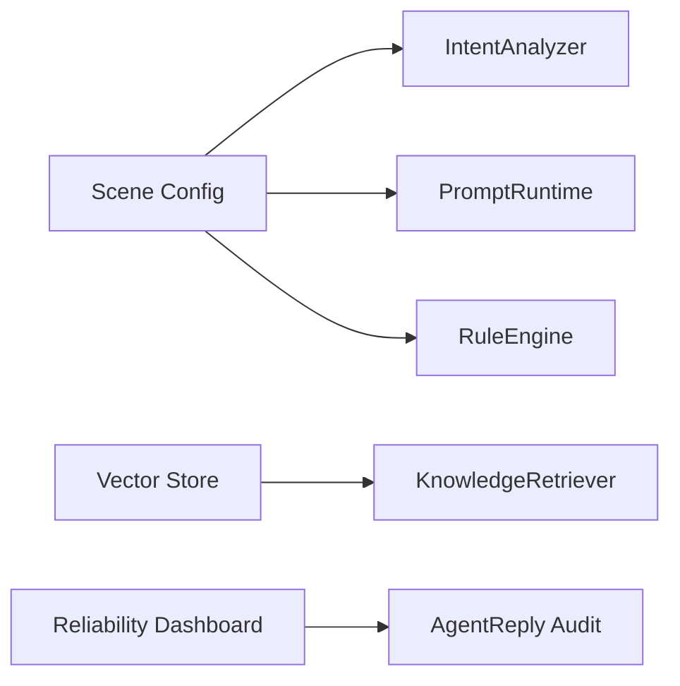

# Domain Model

本文档描述 `agent-customer-service` 的可靠客服 Agent 领域模型。当前运行链路已经引入 `AgentRuntime`，`ChatService` 只保留会话/消息持久化和前端 VO 映射。

## Core Concepts

| 模型 | 说明 | 当前来源 |
|---|---|---|
| `ConversationTurn` | 一次用户输入触发的完整处理回合 | `ChatDTO.SendMessageDTO`、`ChatMessage`、会话上下文 |
| `ConversationMessage` | 会话历史中的单条消息 | `ChatMessage` |
| `IntentAnalysis` | 场景、意图、置信度、情绪和分析引擎 | `LlmService.analyzeUserInput` 或关键词兜底 |
| `KnowledgeRecall` | RAG 或关键词检索返回的知识证据集合 | Product、Activity、FAQ 检索结果 |
| `KnowledgeEvidence` | 可被回复引用的一条证据 | 商品、活动、FAQ、行业、解决方案、人工选择 |
| `GuardrailDecision` | 防幻觉、安全和兜底决策 | 规则兜底、低置信度、无可靠知识、LLM 不可用 |
| `AgentReply` | 一轮回复的完整结果 | `ChatVO.SendMessageVO` |
| `ReasoningStep` | 可审计推理过程 | `ChatVO.ReasoningStepVO` |

## Application Ports

后端 `com.anjing.module.agent.application` 定义端口，`com.anjing.module.agent.runtime` 提供当前 JPA/LLM/规则实现：

| 端口 | 职责 | 不应该做 |
|---|---|---|
| `ConversationMemory` | 读取最近历史、写入用户消息和上下文 | 不调用 LLM，不做检索 |
| `IntentAnalyzer` | 识别场景、意图、情绪和置信度 | 不生成最终回复 |
| `KnowledgeRetriever` | 按意图和上下文召回知识证据 | 不拼接最终话术 |
| `GuardrailPolicy` | 判断是否安全、是否要兜底、兜底原因 | 不直接访问 Controller |
| `ReplyGenerator` | 基于证据生成 LLM 或规则回复 | 不保存会话 |
| `AgentRuntime` | 编排一轮 Agent 处理 | 不承载具体仓储细节 |

当前实现：

| 实现 | 职责 |
|---|---|
| `DefaultAgentRuntime` | 主编排：分析 -> 检索 -> 护栏 -> 回复 -> 推理步骤 |
| `DefaultIntentAnalyzer` | LLM 分析优先，失败后关键词兜底 |
| `JpaKnowledgeRetriever` | Product/Activity/FAQ 的 JPA 关键词检索和人工选择召回 |
| `DefaultGuardrailPolicy` | 低置信度、无可靠知识等兜底决策 |
| `DefaultReplyGenerator` | LLM 回复优先，触发护栏或 LLM 不可用时规则回复 |

## Runtime Boundary

当前真实链路：

目标链路仍需继续补齐：

## Reliability Rules

- 回复必须能说明来源：`AgentReply.knowledgeRecall` 保留召回证据。
- 无可靠知识时不能编造：`GuardrailDecision.fallbackRequired` 应触发规则兜底或转人工。
- 低置信度意图不能强行执行动作：通过 `FallbackReason.LOW_CONFIDENCE` 标记。
- LLM 不可用不影响基础客服：通过 `FallbackReason.LLM_UNAVAILABLE` 使用规则回复。
- 安全或政策拦截必须可审计：通过 `policyTags` 和 `userVisibleNotice` 留痕。

## Migration Plan

1. 已完成：`ChatService` 调用 `AgentRuntime`，现有 API 和前端 VO 不变。
2. 已完成：抽出 `IntentAnalyzer`、`KnowledgeRetriever`、`GuardrailPolicy`、`ReplyGenerator`。
3. 下一步：Scene 配置接入 `IntentAnalyzer`、`PromptRuntime` 和 `RuleEngine`。
4. 下一步：将关键词检索升级为向量检索 + rerank。
5. 下一步：增加可靠性看板，展示兜底原因、知识证据和回复引擎。
