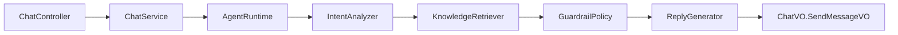
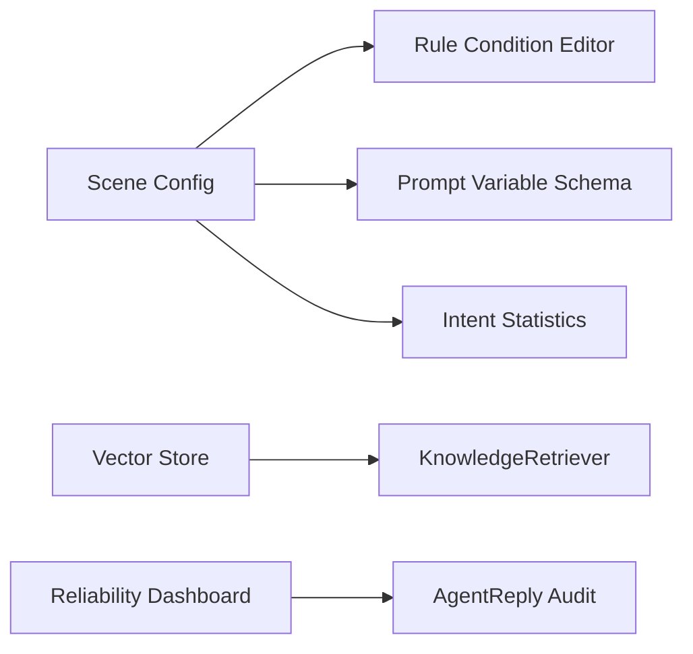

# Domain Model

本文档描述 `agent-customer-service` 的可靠客服 Agent 领域模型。当前运行链路已经引入 `AgentRuntime`，`ChatService` 只保留会话/消息持久化和前端 VO 映射。

## Core Concepts

| 模型 | 说明 | 当前来源 |
|---|---|---|
| `ConversationTurn` | 一次用户输入触发的完整处理回合 | `ChatDTO.SendMessageDTO`、`ChatMessage`、会话上下文 |
| `ConversationMessage` | 会话历史中的单条消息 | `ChatMessage` |
| `IntentAnalysis` | 场景、意图、置信度、情绪和分析引擎 | `LlmService.analyzeUserInput` 或关键词兜底 |
| `KnowledgeRecall` | RAG 或关键词检索返回的知识证据集合 | Product、Activity、FAQ 检索结果 |
| `KnowledgeEvidence` | 可被回复引用的一条证据 | 商品、活动、FAQ、行业、解决方案、人工选择 |
| `GuardrailDecision` | 防幻觉、安全和兜底决策 | 规则兜底、低置信度、无可靠知识、LLM 不可用 |
| `AgentReply` | 一轮回复的完整结果 | `ChatVO.SendMessageVO` |
| `ReasoningStep` | 可审计推理过程 | `ChatVO.ReasoningStepVO` |
| `ChatAgentAudit` | Agent 单轮回复审计事实 | `AgentReply`、`ChatMessage` |
| `ChatRuntimeSnapshot` | Chat Runtime 汇总快照 | `ChatVO.RuntimeOverviewVO` |

## Application Ports

后端 `com.anjing.module.agent.application` 定义端口，`com.anjing.module.agent.runtime` 提供当前 JPA/LLM/规则实现：

| 端口 | 职责 | 不应该做 |
|---|---|---|
| `ConversationMemory` | 读取最近历史、写入用户消息和上下文 | 不调用 LLM，不做检索 |
| `IntentAnalyzer` | 识别场景、意图、情绪和置信度 | 不生成最终回复 |
| `KnowledgeRetriever` | 按意图和上下文召回知识证据 | 不拼接最终话术 |
| `GuardrailPolicy` | 判断是否安全、是否要兜底、兜底原因 | 不直接访问 Controller |
| `ReplyGenerator` | 基于证据生成 LLM 或规则回复 | 不保存会话 |
| `AgentRuntime` | 编排一轮 Agent 处理 | 不承载具体仓储细节 |

当前实现：

| 实现 | 职责 |
|---|---|
| `DefaultAgentRuntime` | 主编排：分析 -> 检索 -> 护栏 -> 回复 -> 推理步骤 |
| `DefaultIntentAnalyzer` | LLM 分析优先，失败后关键词兜底 |
| `JpaKnowledgeRetriever` | Product/Activity/FAQ 的 JPA 关键词检索和人工选择召回 |
| `DefaultGuardrailPolicy` | 低置信度、无可靠知识等兜底决策 |
| `DefaultReplyGenerator` | LLM 回复优先，触发护栏或 LLM 不可用时规则回复 |
| `RuleEngine` | 执行启用规则，支持内置规则码和轻量 JSON 条件表达式，返回命中原因和动作 |
| `PromptRuntime` | 渲染启用 SYSTEM Prompt，注入变量并返回可观测结果；变量 schema 在配置阶段校验 |

Chat 运行审计：

| 字段 | 说明 |
|---|---|
| `sessionId` / `messageId` | 对应一次助手回复 |
| `sceneType` / `intentCode` / `intentName` / `confidence` | 意图分析结果 |
| `replyEngine` | 本轮回复来自 LLM、规则或混合链路 |
| `safe` / `fallbackRequired` / `fallbackReason` | 护栏和兜底结论 |
| `knowledgeEvidenceCount` | 本轮召回证据数量 |
| `ruleHitCount` | 本轮命中规则数量 |
| `promptRenderCount` | 本轮渲染 Prompt 数量 |

Chat 运行趋势：

| 指标 | 说明 |
|---|---|
| `qualitySummary.averageConfidence` | 已审计回复的平均意图置信度 |
| `qualitySummary.fallbackRate` | 已审计回复中的兜底比例 |
| `qualitySummary.unsafeRate` | 已审计回复中的不安全比例 |
| `dailyTrends.replies` | 近 7 日每日 Agent 回复数 |
| `dailyTrends.fallbackReplies` | 近 7 日每日兜底回复数 |
| `dailyTrends.unsafeReplies` | 近 7 日每日不安全回复数 |

Chat 运行快照：

| 字段 | 说明 |
|---|---|
| `snapshotDate` | 快照归属日期 |
| `snapshotType` | `manual` 手动采样或 `scheduled` 定时采样 |
| `totalSessions` / `totalMessages` | 采样时累计会话和消息 |
| `totalAuditedReplies` | 采样时累计已审计回复 |
| `averageConfidence` / `fallbackRate` / `unsafeRate` | 采样时质量摘要 |

定时采样默认关闭，可通过 `CS_RUNTIME_SNAPSHOT_ENABLED=true` 开启，并用 `CS_RUNTIME_SNAPSHOT_CRON` 覆盖默认 cron。

Scene 配置接入点：

| 配置 | Runtime 影响 |
|---|---|
| 启用的 `Intent` | LLM 分析失败时，按优先级和触发关键词参与意图识别 |
| 启用的 SYSTEM `Prompt` | 由 `PromptRuntime` 按场景过滤、变量渲染后注入 `LlmService` 上下文 |
| 启用的 `Rule` | 由 `RuleEngine` 执行；支持 `SENSITIVE_FILTER`、`TRANSFER_THRESHOLD`、`VIP_PRIORITY` 内置规则码、JSON 条件表达式和表达式测试 |

Scene 运行洞察：

| 指标 | 说明 |
|---|---|
| 规则平均命中 | `totalRuleHits / activeRuleCount`，观察规则是否真实参与运行 |
| Prompt 平均使用 | `totalPromptUsage / activeSystemPromptCount`，观察 SYSTEM Prompt 是否被消费 |
| 规则集中度 | Top 规则命中占比，过高说明规则策略可能过度集中 |
| Prompt 集中度 | Top Prompt 使用占比，过高说明提示词模板可能缺少场景分流 |

## Rule Condition V1

`Rule.conditions` 支持轻量 JSON 表达式；`Rule.actions` 支持配置命中后的原因和动作。空条件继续走内置规则码。

```json
{
  "all": [
    { "field": "intentCode", "op": "eq", "value": "RETURN_EXCHANGE" },
    { "field": "confidence", "op": "lt", "value": 0.7 }
  ]
}
```

```json
{
  "reason": "退换货意图置信度不足，需要澄清或转人工",
  "action": "TRANSFER_OR_CLARIFY"
}
```

支持字段：`userMessage`、`sceneType`、`intentCode`、`intentName`、`confidence`、`emotion`、`knowledgeCount`、`hasReliableKnowledge`、`context.xxx`。

支持操作符：`eq`、`ne`、`contains`、`not_contains`、`gt`、`gte`、`lt`、`lte`、`in`、`is_empty`、`is_not_empty`。

## Runtime Boundary

当前真实链路：



目标链路仍需继续补齐：



## Reliability Rules

- 回复必须能说明来源：`AgentReply.knowledgeRecall` 保留召回证据。
- 无可靠知识时不能编造：`GuardrailDecision.fallbackRequired` 应触发规则兜底或转人工。
- 低置信度意图不能强行执行动作：通过 `FallbackReason.LOW_CONFIDENCE` 标记。
- LLM 不可用不影响基础客服：通过 `FallbackReason.LLM_UNAVAILABLE` 使用规则回复。
- 安全或政策拦截必须可审计：通过 `policyTags` 和 `userVisibleNotice` 留痕。

## Migration Plan

1. 已完成：`ChatService` 调用 `AgentRuntime`，现有 API 和前端 VO 不变。
2. 已完成：抽出 `IntentAnalyzer`、`KnowledgeRetriever`、`GuardrailPolicy`、`ReplyGenerator`。
3. 已完成：Scene 配置轻量接入 `IntentAnalyzer`、`ReplyGenerator` 和 `GuardrailPolicy`。
4. 已完成：轻量 `RuleEngine`，支持内置规则码命中和动作解释。
5. 已完成：`PromptRuntime` 基础变量渲染，前端可靠性面板展示渲染结果。
6. 已完成：`RuleEngine` 轻量 JSON 条件表达式，支持 `all`/`any`、字段操作符和动作驱动护栏。
7. 已完成：Rule 条件/动作编辑器和前后端 JSON 校验。
8. 已完成：Prompt 变量 schema、编辑态校验、运行时变量快捷填充和测试入口。
9. 已完成：Rule 表达式测试入口，支持模拟运行时字段并查看命中原因和动作。
10. 已完成：Scene Runtime Overview，展示启用配置、规则命中、Prompt 使用和 Top 项。
11. 已完成：Chat Runtime Overview，展示会话、消息、活跃状态、今日消息和最近会话。
12. 已完成：Chat Agent Audit，沉淀每轮回复的意图、引擎、护栏、召回、规则和 Prompt 审计事实。
13. 已完成：Chat Runtime Trend，基于审计事实展示平均置信度、兜底率、不安全率和 7 日趋势。
14. 已完成：Chat Runtime Snapshot，支持手动采样和可配置定时采样，沉淀长期趋势基础数据。
15. 已完成：Scene Runtime Insight，展示规则/Prompt 平均使用和集中度，辅助配置运营。
16. 下一步：将关键词检索升级为向量检索 + rerank。
17. 下一步：增加跨 Scene/Prompt/Rule 的长期命中趋势和会话质检摘要。
